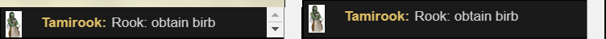
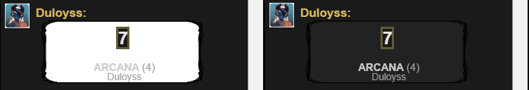
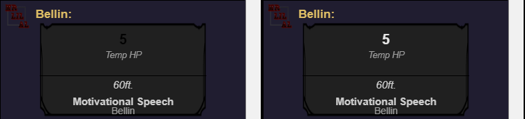

# Roll20 Dark Fixes

This applies bug fixes to RedReign's "Roll20 Dark" plugin, which can be found [here](https://openuserjs.org/scripts/RedReign/Roll20_Dark).

## Chat "Small Scrollbar" Fix:

## Chat "Skill Background" Fix:

## Chat "Sheet Damage" Fix:

## Setting Up Roll20 Dark Fixes

For each fix, there is a variable that you can choose to enable or disable the fix.

### Default Settings

By default, all fixes are enabled. If you'd like to disable certain fixes, you can do so by changing "enabled" to "disabled".

By default, if the page is not loaded, it will wait only 10 milliseconds to attempt to apply fixes again. While it's not recommended, you may change it.

### Changing the Default Settings

In order for a fix to apply, it must be enabled, like this:  
fixChatSmallScrollbar = 'enabled';  
To disable the fix, you can disable it by exchanging "enabled" for "disabled" , like this:
fixChatSmallScrollbar = 'disabled';

By default, if the page is not laoded, it will wait 10 milliseconds to attempt to apply the fixes again. While it's not recommended, you may change it however you please. This is what it looks like by default:  
applicationInterval = 10;  
If you do choose to change it, just change the number. Do not add any quotation marks.

## Using Roll20 Dark Fixes

All that's needed for the code to run is for the plugin to be enabled. This will automatically apply the fixes that you have enabled.

## Updating Roll20 Dark Fixes

The main script (the one that you use in Tampermonkey, Greasemonkey, or an equivalent program - AddVantage.user.js) should automatically update over time, if there are updates. If you'd like, you may check the support URL in the script (which directs to this page) and check manually if there was an update.

If there was an update, please keep in mind which settings you had changed previously. Updating the script will overwrite any changes you have made.

## Updating the Background Script

The background script (in the "@require" tag in the top of the userscript - AddVantageBackground.js) should update automatically, meaning you shouldn't have to do anything. If you do find that the background script isn't updating as it should be, change the "@require" tag's link, save the script, then change it back and save it again. That should then load the latest version of the background script.

## Support

If you notice any bugs or would like a certain feature to be implemented to this script, feel free to either message me or submit a ticket (under the "Issue" tab on GitHub).

If you do not want to create a ticket or have any questions reguarding this script, feel free to message me.

[GitHub: Mrlilal](https://github.com/Mrlilal) || Discord: Mrlilal#3758 || [Twitter: @Mrlilal](https://twitter.com/mrlilal)

## Disclaimers

### Roll20

This plugin was built for Roll20. We do not own any content that is on Roll20.

### Roll20 Dark

This plugin was made to fix bugs with [Roll20 Dark](https://openuserjs.org/scripts/RedReign/Roll20_Dark), which was created by RedReign. We do not own Roll20 Dark.
